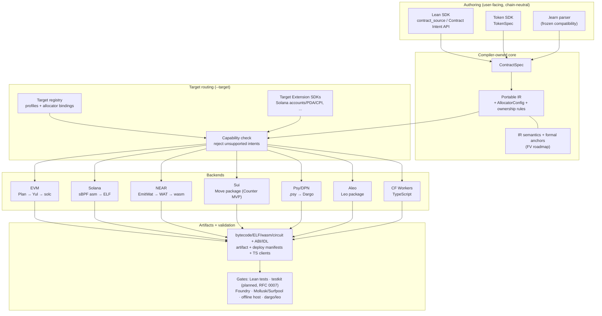

# ProofForge

Lean-first multi-chain smart contract platform.

ProofForge's goal is one verified Lean contract codebase that can be compiled,
tested, and deployed across multiple blockchain target families. Contracts are
written against a chain-neutral Contract Intent API; the compiler lowers them
to a portable IR, routes capabilities per target, and emits chain-native
artifacts. Unsupported target capabilities are rejected at compile time
instead of silently changing semantics.

Start here:

- [docs/INDEX.md](docs/INDEX.md) — full documentation map.
- [RFC 0001](docs/rfcs/0001-multichain-platform.md) — multi-chain architecture
  and roadmap; [RFC 0002](docs/rfcs/0002-target-implementation-design.md) —
  target implementation design.
- [Design decisions](docs/decisions.md) — settled choices (D-001…D-045).
- [Formal verification roadmap](docs/formal-verification.md) — existing proof
  anchors and staged theorem targets.
- [Demo recording](https://asciinema.org/a/fn6o6kSxB5RpMXJl) — terminal demo: author → compile → deploy → test.

中文文档：

- [中文文档索引](docs/zh/README.md)
- [架构评审（2026-07）：统一 SDK 输入与分支收敛](docs/zh/architecture-review-2026-07.md)
- [多链愿景可行性分析](docs/zh/feasibility-analysis.md)

## Backend Status

The machine-readable support matrix (maturity, input modes, commands, output
stages, validation level) is generated from `proof-forge --list-targets --json`
into [`docs/generated/backend-status.md`](docs/generated/backend-status.md)
(`just target-support` / `just backend-status-gen`). The narrative table below
remains the human overview of pipelines and local validation; the generated
table is the PF-P1-02 contract.

All backends live on `main` (chains are directories and target ids, not
branches). Lifecycle stages follow [docs/targets/README.md](docs/targets/README.md).
The primary-chain completion covenant (D-045) is closed and all P0 SDK
blockers across `evm`, `solana-sbpf-asm`, and `wasm-near` are resolved:
**0 open P0 blockers** remain. Unified SDK schema/layout outputs now exist
for `evm`, `solana-sbpf-asm`, `wasm-near`, and `move-sui` via the portable
Counter flow. Three-chain portable scenarios (Counter, ValueVault) compile
and execute on EVM, Solana, and NEAR via `just portable-counter-multi-target`
and `just portable-value-vault`; Sui is intentionally scoped to a Counter MVP
with local `sui move build/test` validation.

| Target id | Pipeline | Stage | Local validation |
|---|---|---|---|
| `evm` | Lean / portable IR → Yul → `solc` → bytecode | Experimental (production-grade gates) | golden Yul, diagnostics, Foundry runtime smoke (15 tests), Anvil deploy, dynamic constructor Anvil, constructor body, deploy gas-limit/price/priority flags, stdlib (ERC-20/721/1155/165/AccessControl/Ownable/Pausable/ReentrancyGuard/UUPS/Create2 — see [sdk-ecosystem-gaps](docs/sdk-ecosystem-gaps-2026-07.md)) |
| `solana-sbpf-asm` | portable IR → sBPF assembly → `sbpf` → ELF | Experimental | Mollusk tests, Surfpool/Rust live smokes, Pinocchio equivalence gates, indexed events, Memo CPI, Associated Token `create_idempotent` CPI, Token-2022 extensions (transfer_fee/non_transferable/metadata_pointer/default_account_state/immutable_owner/permanent_delegate/interest_bearing/memo_transfer/transfer_hook_init/pausable), map storage, nativeValue lamports read |
| `wasm-near` | portable IR → `EmitWat` (Wasm AST → WAT) → `wat2wasm` | Experimental | diagnostics, IR coverage manifests, formal trace obligations, target-first smoke, offline host smoke (signer+deposit+promise stubs), artifact/deploy metadata, NEP-141 FT stdlib, aggregate ABI params, nested mapKey paths, nativeValue U64 truncation, eventEmitIndexed flattening |
| `wasm-stellar-soroban` | portable IR → `EmitWat` + `HostBridge.soroban` → WAT → `wat2wasm` | Counter MVP (PF-P3-02 six-gate) | `just soroban-promotion` (source identity · fail-closed · HostBridge · wat2wasm · offline-host lifecycle · docs); auth still spike-always; Stellar CLI/TTL remain follow-on |
| `wasm-cosmwasm` | portable IR → `EmitWat` → WAT → `wat2wasm` | Spike (**G1a not started**) | Counter golden WAT; portable remote uses **execute_msg STUB** (not full submessages); `just cosmwasm-counter-smoke` optional |
| `move-aptos` | portable IR → Aptos Move package | Spike | Counter golden Move module, `just aptos-counter-smoke` (optional GH job; needs `aptos`) |
| `move-sui` | portable IR → Sui Move package | Counter MVP | Counter package layout, local `sui move build/test`, unsupported-shape diagnostics, emit/build parity, object semantics, local-only validation, TypeScript client smoke |
| `psy-dpn` | portable IR → `.psy` → Dargo → DPN circuit JSON | Experimental (restricted subset) | golden sources, diagnostics, `dargo` execute smokes |
| `aleo-leo` | portable IR → Leo package → `leo build`/`leo test` | Research spike (listed; fixture emit + optional `leo` gates) | Counter/PureMath golden fixtures and smokes |
| `wasm-cloudflare-workers` | portable IR → TypeScript Worker | Research spike (fixture `emit` only) | `tsc` type-check, `wrangler` dry-run |

**CLI-only verification target:** `quint` is accepted by `proof-forge emit --target quint`
for formal/model-checking fixtures but is **not** in `Target.knownIds` /
`--list-targets` (same class as a verification lane, not a product host).


**Spike honesty (U7):** CosmWasm / Aptos / Soroban / Cloudflare are **not**
primary-product hosts. CosmWasm portable crosscall is a WasmMsg-shaped
`execute_msg` stub; Soroban interpreter `require_auth_for_args` is always-auth
in Lean. Gate G1a/G1b (CosmWasm/Aptos M3–M4) stay **not started** until
explicitly scheduled — see [gate-status](docs/gate-status.md) and
[unified-support-roadmap](docs/superpowers/plans/2026-07-09-unified-support-roadmap.md) U7.

The multi-chain Token SDK (`TokenSpec`, [RFC 0006](docs/rfcs/0006-multichain-token-sdk.md))
routes one token intent to ERC-20 bytecode on EVM or SPL Token / Token-2022
deployment plans on Solana.

## Getting Started

Install `just` from [casey/just](https://github.com/casey/just); the root
`justfile` is the developer-facing command catalog and CI entrypoint.

```sh
just --list        # all recipes
just build         # lake build
just product       # product-first: Examples/Product multi-target matrix (required CI)
just check         # product + backend static gates (Lean + Solana-light + NEAR + Psy + testkit + …)
just evm-all       # full EVM gates: examples, Foundry smoke, Anvil deploy
just portable-counter-four-target-sdk  # Counter SDK layout for EVM, Solana, NEAR, Sui
just sui-counter-smoke                 # local Sui Move Counter build/test
just ci            # the full CI sequence locally
```

Build directly with Lake:

```sh
lake build
```

Compile the EVM Counter example to runtime bytecode:

```sh
lake env proof-forge build --target evm --root . --module contract \
  -o build/evm/Counter.bin Examples/Backend/Evm/Contracts/Counter.lean
```

Emit artifacts for other targets from built-in portable IR fixtures:

```sh
lake env proof-forge emit --target wasm-near --fixture counter --format wat -o build/wasm-near
lake env proof-forge emit --target solana-sbpf-asm --fixture counter --format elf -o build/solana/counter.so
lake env proof-forge emit --target move-sui --fixture counter --format sui -o build/sui
lake env proof-forge emit --target psy-dpn --fixture counter --format psy -o build/psy/Counter.psy
lake env proof-forge emit --target aleo-leo --fixture counter --format leo -o build/aleo
lake env proof-forge emit --target wasm-cloudflare-workers --fixture counter --format ts -o build/ts/Counter.ts
```

The complete, per-target list of runnable validation commands and their tool
prerequisites (Foundry, `solc`, `sbpf`, `wat2wasm`, `dargo`, `leo`,
`wrangler`, …) lives in [docs/validation-gates.md](docs/validation-gates.md).
Cloud/agent environment notes are in [AGENTS.md](AGENTS.md).

## Architecture



- **Contract Intent API** — the default SDK surface: state, entrypoints,
  events, caller/value access, checked arithmetic, assertions, and proofs,
  without importing a destination-chain module.
- **Target Extension SDKs** — explicit chain-native semantics when a contract
  needs them (Solana accounts/PDA/CPI, allocator selection, …). Extensions
  lower through capability ids and target metadata, never by adding
  chain-only constructors to the portable IR (D-027).
- **Target adapters** — ABI, packaging, test-runner, and deployment logic per
  chain family; `--target` selects the adapter, and unsupported intents are
  rejected before artifact generation (D-028).

See [docs/authoring-model.md](docs/authoring-model.md) for the authoring
layers (the legacy `.learn` parser is a frozen compatibility surface, not a
second product language) and [docs/portable-ir.md](docs/portable-ir.md) for
the IR spec. Editable [Excalidraw architecture diagrams](docs/diagrams/README.md)
(open on [excalidraw.com](https://excalidraw.com)) complement the Mermaid figure above.

## Development Docs

- [Development standards](docs/development-standards.md)
- [Validation gates](docs/validation-gates.md)
- [Implementation backlog](docs/implementation-backlog.md) — Workstream 24
  (post-consolidation follow-ups) and Workstream 25 (formal verification)
  are the current priority.
- [Capability registry](docs/capability-registry.md)
- [Shared scenario: Counter](docs/shared-scenario.md) — the cross-target
  acceptance test; the current phase goal is passing it on `evm`,
  `solana-sbpf-asm`, and `wasm-near`.
- Target notes: [docs/targets/](docs/targets/README.md)

## Authoring Module Naming

- **Portable authoring module:** `ProofForge.Contract.Source` (default for new
  chain-neutral contracts and templates).
- **Target selection:** `proof-forge --target <id>` chooses EVM, Solana, NEAR,
  Sui, or another backend at build/emission time; portable contract sources
  should not import a destination-chain module just to select an output chain.
- **EVM-native module:** `ProofForge.Evm` with namespace `Lean.Evm` remains for
  legacy EVM examples and explicit EVM-only adapter work.

The `Lean.Evm` namespace comes from the Lean fork migration. The rename to a
uniform `ProofForge.*` namespace is tracked in the backlog (Workstream 24),
because `Lean.Evm` shadows the Lean compiler's own `Lean` namespace.

## Roadmap

```text
Phase 0: EVM baseline                      (done)
Phase 1: target registry + portable IR     (done)
Phase 2+: parallel backend spikes          (Solana, NEAR, Psy on main;
                                            Sui Counter MVP;
                                            Aleo, CF Workers research)
Phase 3:  three-chain P0 SDK cleanup        (done — 0 open P0 blockers;
                                            Counter + ValueVault portable
                                            on evm + solana-sbpf-asm + wasm-near)
Current:  P1 feature expansion — full NEAR Promise async execution,
          Solana map storage, EVM dynamic constructor args runtime,
          Sui beyond-Counter planning, Pinocchio reference breadth,
          formal verification (Workstream 25)
Later:    Move family expansion, cloud platform (after two+ targets reach
          Experimental with shared-scenario parity; D-010)
```

Canonical target ids and the full decision log: [docs/decisions.md](docs/decisions.md).
The filename `docs/targets/solana-sbf.md` is a historical alias for the
Solana target notes; the canonical route is `solana-sbpf-asm` (D-026).
