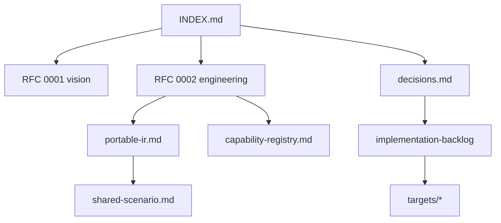

# ProofForge Documentation Index

ProofForge is a Lean-first multi-chain smart contract platform. The trunk
contains the EVM baseline plus Solana (sBPF assembly), NEAR (EmitWat), Sui
(Counter MVP), CosmWasm and Aptos (Counter spikes), Psy/DPN, Aleo Leo, and
Cloudflare Workers (TypeScript spike) backends behind one portable IR and
capability registry, following the 2026-07 branch consolidation.

**Current phase:** Gate P0 and the [2026-07-10 multi-chain gap audit](multi-chain-gap-audit-2026-07-10.md)
remediation (PF-P0…P3) are closed. Active execution is
[post-review deepen-triad plan](superpowers/plans/2026-07-10-post-review-execution.md):
NEAR/EVM/Solana product depth, platform debt (CLI M4, versioning, upgrades),
and honest FV fragment growth — **not** secondary-chain promotion.

## Documentation Map

| If you are… | Start here | Then read |
|---|---|---|
| New contributor | This page + [README](../README.md) + [Onboarding](onboarding.md) | [Portable three-target tutorial](tutorials/portable-contract-three-targets.md), [Validation gates](validation-gates.md), [backlog](implementation-backlog.md) |
| Implementing a backend | [RFC 0002](rfcs/0002-target-implementation-design.md) | [decisions](decisions.md), [portable IR](portable-ir.md), target notes |
| Reviewing design | [review-checklist](review-checklist.md) | RFCs, [capability registry](capability-registry.md), [shared scenario](shared-scenario.md) |
| Strategy / 中文读者 | [zh/README](zh/README.md) | [可行性分析](zh/feasibility-analysis.md), [decisions](decisions.md) |

## Architecture diagrams (Excalidraw)

Editable hand-drawn-style diagrams for presentations and onboarding — open on
[excalidraw.com](https://excalidraw.com) or in-editor with an Excalidraw plugin:

- [Diagram catalog](diagrams/README.md) — seven `.excalidraw` files covering
  platform overview, compile pipeline, multi-target Counter, capability routing,
  developer workflow, codebase layout, and target landscape.

## Specs and Decisions

- [Design decisions](decisions.md): settled architecture choices and roadmap summary.
- [Portable Contract IR](portable-ir.md): IR sketch and Phase 1 acceptance criteria.
- [RFC 0003: Portable IR and runtime](rfcs/0003-portable-ir-and-runtime.md): detailed IR/capability/runtime draft.
- [RFC 0004: EVM semantic plan and Yul AST boundary](rfcs/0004-evm-semantic-plan.md): target-semantic EVM plan layer between portable IR and low-level Yul syntax.
- [Capability registry](capability-registry.md): canonical capability ids.
- [Host · Protocols · Stdlib (A/B/C)](protocols-layer.md): chain runtime vs on-chain program clients vs deployable stdlib.
- [**Product SDK** (author path)](product-sdk.md): only surface you need — intent → `--target` → artifacts.
- [Product / SDK gap plan (2026-07)](product-sdk-gap-plan-2026-07.md): gaps and waves α–ε.

- [Host runtime abstraction](host-runtime.md): portable HostEffect → EVM opcode / Solana syscall / NEAR host import.
- [Multi-chain remediation agent goal](agent-goal-prompt.md): historical PF-P0…P3 Complete ledger (do not reopen closed rows).
- [Post-review execution plan (2026-07-10)](superpowers/plans/2026-07-10-post-review-execution.md): **active** queue — deepen primary triad, platform debt, FV fragment.
- [Shared scenario: Counter](shared-scenario.md): cross-target acceptance test.
- [Doc↔code sync audit (2026-07)](doc-code-sync-audit-2026-07.md): drift register and maintenance checklist.
- [Tutorial: one module, three targets](tutorials/portable-contract-three-targets.md): portable `contract_source` walkthrough (CS-5.3).
- [Tutorial: Shared path from zero](tutorials/portable-shared-path.md): Counter → Ownable → Token → Remote (`just product`, T4.2).
- [Examples & tests taxonomy](examples-and-tests-taxonomy.md): Product vs Backend vs IR.

## RFCs

Accepted engineering direction ([rfcs/README](rfcs/README.md)):

- [RFC 0001: Lean-first multi-chain contract platform](rfcs/0001-multichain-platform.md)
- [RFC 0002: Target implementation design](rfcs/0002-target-implementation-design.md)
- [RFC 0003: Portable IR and runtime profiles](rfcs/0003-portable-ir-and-runtime.md) (Draft — extends 0001/0002)
- [RFC 0004: EVM semantic plan and Yul AST boundary](rfcs/0004-evm-semantic-plan.md) (Draft — EVM backend internal architecture)
- [RFC 0005: Solana sBPF assembly backend](rfcs/0005-solana-sbpf-assembly-backend.md) (Accepted — canonical Solana route, D-026)
- [RFC 0006: Multi-chain Token SDK](rfcs/0006-multichain-token-sdk.md) (Draft)
- [RFC 0007: Unified Rust test framework](rfcs/0007-unified-rust-test-framework.md) (Draft — testkit scenarios over revm/Mollusk/wasmtime)
- [RFC 0008: Chain-decoupled allocator abstraction](rfcs/0008-allocator-abstraction.md) (Draft — one allocator model bound per target)

## Engineering

- [Development standards](development-standards.md): contributor rules and source-of-truth map.
- [Onboarding](onboarding.md): local setup path, editor notes, and the minimum
  validation loop for new contributors.
- [Quint model generation](quint.md): emit executable state-machine models from portable IR, simulate, model-check, and replay MBT traces.
- [Development log](development-log.md): milestone log with validation notes and next steps.
- [Authoring model](authoring-model.md): Learn source, `contract_source`, and internal `ContractSpec` boundaries.
- [Validation gates](validation-gates.md): runnable gates and tool prerequisites.
- [Formal verification roadmap](formal-verification.md): existing formal anchors and staged proof targets.
- [Solana sBPF executable trace](solana-sbpf-executable-trace.md): in-Lean Counter + ValueVault scalar/event plus fixed-array/u64-map storage target semantics for direct sBPF assembly.
- [WASM executable trace](wasm-executable-trace.md): in-Lean Counter + ValueVault scalar/event plus fixed-array/u64-map storage target semantics for EmitWat/NEAR.
- [Target portfolio roadmap](target-roadmap.md): tiered sequencing for the remaining research targets and the Bitcoin policy family (D-034).
- [Platform gap analysis 2026-07](platform-gaps-2026-07.md): unplanned dimensions (CLI surface, versioning, budgets, upgrades/signing, error model, clients) and their sequencing hooks.
- [Multi-chain vision gap audit (2026-07-10)](multi-chain-gap-audit-2026-07-10.md): code-backed target status, prioritized findings, remediation waves, and acceptance gates.
- [Implementation backlog](implementation-backlog.md): staged tasks and acceptance criteria.
- [Product authoring architecture](product-authoring-architecture.md): business-intent vs chain materialization; Phase A–C status.
- [Portable SDK unification plan (2026-07-09)](superpowers/plans/2026-07-09-portable-sdk-unification.md): **complete** (policy · Token · remote · author polish).
- [Unified support roadmap (2026-07-09)](superpowers/plans/2026-07-09-unified-support-roadmap.md): prior unification waves (historical context; unfinished U4/U6 absorbed by post-review plan).
- [Post-review execution plan (2026-07-10)](superpowers/plans/2026-07-10-post-review-execution.md): **active** — S0 trunk · N1 NEAR · E1 EVM · L1 Solana · **B1 benchmarks** · **Z1 Psy DPN** · **Z2 Aleo Instructions** · P1 platform · F1 FV · D1 DX.
- [Benchmarks (PF vs native)](benchmarks.md): B1 matrix skeleton — behavior + native cost dimensions (no fake cross-chain score).
- [CLI M4 legacy inventory](cli-m4-legacy-inventory.md): EmitMode/flag zoo inventory before alias deletion.
- [CLI M4 deletion checklist](cli-m4-deletion-checklist.md): ordered delete steps (compat window).
- [RFC 0012 versioning](rfcs/0012-versioning-and-compatibility-policy.md) + `just versioning-policy`.
- [Upgrade/signing ops (RFC 0013)](upgrade-signing-ops.md): unsigned emit + live-gate key conventions.
- [Client schema parity (U6.4)](client-schema-parity.md): entrypoint names + assertionId catalogue.
- [Review checklist (English)](review-checklist.md)
- [Target notes](targets/README.md): per-family research and spike plans.
  - [EVM](targets/evm.md)
  - [Wasm family](targets/wasm-family.md)
  - [Wasm-NEAR](targets/wasm-near.md)
  - [Cloudflare Workers target](targets/cloudflare-workers.md)
  - [Stellar Soroban target](targets/stellar-soroban.md)
  - [Internet Computer target](targets/internet-computer.md)
  - [Algorand AVM target](targets/algorand-avm.md)
  - [Solana sBPF Asm](targets/solana-sbpf-asm.md) (canonical direct-assembly route)
  - [Solana sBPF](targets/solana-sbf.md) (superseded Zig/sbpf-linker route)
  - [Move family](targets/move-family.md)
  - [Cardano Plutus/Aiken target](targets/cardano-plutus-aiken.md)
  - [Tezos Michelson/LIGO target](targets/tezos-michelson-ligo.md)
  - [Starknet Cairo target](targets/starknet-cairo.md)
  - [Aleo Leo target](targets/aleo-leo.md)
  - [Aleo Leo design spec](superpowers/specs/2026-07-01-aleo-leo-design.md)
  - [TON TVM target](targets/ton-tvm.md)
  - [Bitcoin Script/Miniscript target](targets/bitcoin-script-miniscript.md)
  - [Zcash Shielded target](targets/zcash-shielded.md)
  - [Bitcoin Cash CashScript target](targets/bitcoin-cash-cashscript.md)
  - [Psy DPN ZK target](targets/psy-dpn.md)
  - [Kaspa Toccata target](targets/kaspa-toccata.md)

## Chinese Notes

- [中文文档索引](zh/README.md)
- [架构评审 2026-07：统一 SDK 输入与分支收敛](zh/architecture-review-2026-07.md)
- [全量代码 + 架构评审 2026-07（FV-5 能力门分支）](zh/code-review-2026-07-fv5-capability-gate.md) — 实现正确性与 FV 可靠性
- [执行任务清单 + WASM 家族与调用层规划 2026-07](zh/execution-plan-2026-07.md) — 分轨任务、WASM 新链模板、调用文档生成
- [多链愿景可行性分析](zh/feasibility-analysis.md)
- [多链技术实现方案](zh/technical-implementation-plan.md) — summary; engineering detail in RFC 0002
- [多链方案 Review 清单](zh/review-checklist.md)
- [Psy/DPN ZK Target 初步分析](zh/zk-psy-target-analysis.md)

## Current Implementation Baseline

- The target registry (`ProofForge/Target/Registry.lean`), portable IR
  (`ProofForge/IR/Contract.lean`), capability routing, and
  `proof-forge-artifact.json` emission are implemented.
- EVM: `proof-forge build --target evm` compiles `contract_source` modules through
  portable IR, the EVM semantic plan, Yul, and `solc --strict-assembly`.
  Foundry and Anvil smokes validate runtime behavior.
- Solana: `proof-forge emit --target solana-sbpf-asm --format s|elf` emits
  sBPF assembly and ELF packages, validated by Mollusk, Surfpool/Rust, and
  Pinocchio equivalence gates.
- NEAR: `proof-forge emit|build --target wasm-near --format wat` lowers
  portable IR through the Wasm AST to WAT, with formal trace obligations
  (`Tests/NearWasmFormal.lean`), target-first metadata, and an offline host
  smoke.
- Psy/DPN, Aleo Leo, and Cloudflare Workers emit target sources from
  portable IR fixtures; see [validation-gates.md](validation-gates.md) for
  each gate's tool prerequisites.
