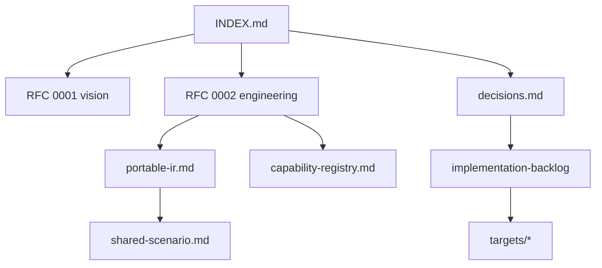

# ProofForge Documentation Index

ProofForge is a Lean-first multi-chain smart contract platform. The current
repository contains the EVM backend baseline and the design track for expanding
the compiler, SDK, test runners, and deployment surface to additional chains.

**Current phase:** Phase 0 complete (EVM baseline); Phase 1 in progress (target
registry, portable IR, artifact metadata).

## Documentation Map

| If you are… | Start here | Then read |
|---|---|---|
| New contributor | This page + [README](../README.md) | [EVM target notes](targets/evm.md), [backlog](implementation-backlog.md) |
| Implementing a backend | [RFC 0002](rfcs/0002-target-implementation-design.md) | [decisions](decisions.md), [portable IR](portable-ir.md), target notes |
| Reviewing design | [review-checklist](review-checklist.md) | RFCs, [capability registry](capability-registry.md), [shared scenario](shared-scenario.md) |
| Strategy / 中文读者 | [zh/README](zh/README.md) | [可行性分析](zh/feasibility-analysis.md), [decisions](decisions.md) |

## Specs and Decisions

- [Design decisions](decisions.md): settled architecture choices and roadmap summary.
- [Portable Contract IR](portable-ir.md): IR sketch and Phase 1 acceptance criteria.
- [RFC 0003: Portable IR and runtime](rfcs/0003-portable-ir-and-runtime.md): detailed IR/capability/runtime draft.
- [Capability registry](capability-registry.md): canonical capability ids.
- [Shared scenario: Counter](shared-scenario.md): cross-target acceptance test.

## RFCs

Accepted engineering direction ([rfcs/README](rfcs/README.md)):

- [RFC 0001: Lean-first multi-chain contract platform](rfcs/0001-multichain-platform.md)
- [RFC 0002: Target implementation design](rfcs/0002-target-implementation-design.md)
- [RFC 0003: Portable IR and runtime profiles](rfcs/0003-portable-ir-and-runtime.md) (Draft — extends 0001/0002)

## Engineering

- [Development standards](development-standards.md): contributor rules and source-of-truth map.
- [Validation gates](validation-gates.md): runnable gates and tool prerequisites.
- [Implementation backlog](implementation-backlog.md): staged tasks and acceptance criteria.
- [Review checklist (English)](review-checklist.md)
- [Target notes](targets/README.md): per-family research and spike plans.
  - [EVM](targets/evm.md)
  - [Wasm family](targets/wasm-family.md)
  - [Solana sBPF](targets/solana-sbf.md) (`solana-sbpf-linker`)
  - [Move family](targets/move-family.md)

## Chinese Notes

- [中文文档索引](zh/README.md)
- [多链愿景可行性分析](zh/feasibility-analysis.md)
- [多链技术实现方案](zh/technical-implementation-plan.md) — summary; engineering detail in RFC 0002
- [多链方案 Review 清单](zh/review-checklist.md)

## Current Implementation Baseline

- EVM contracts use `ProofForge.Evm` (`open Lean.Evm`).
- `proof-forge --evm-bytecode` compiles Lean contracts through LCNF, Yul, and
  `solc --strict-assembly`.
- `scripts/evm/foundry-smoke.sh` validates generated runtime bytecode with
  Foundry's local EVM test runner.
- Target registry, portable IR in code, and `proof-forge-artifact.json` are
  planned (Phase 1) — see [backlog](implementation-backlog.md).
