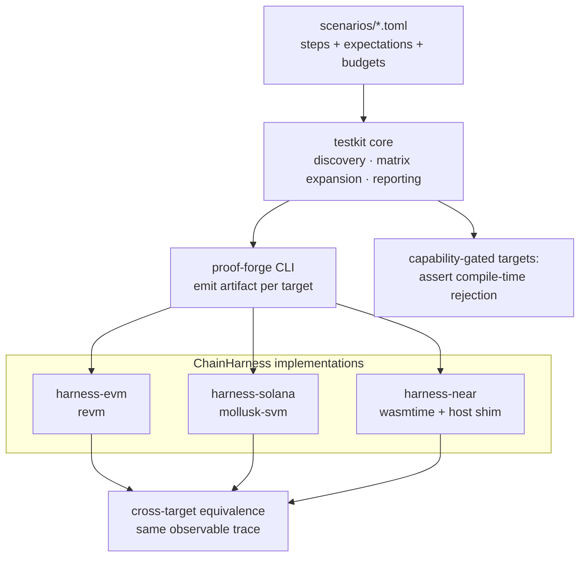

# RFC 0007: Unified Rust Test Framework (testkit)

Status: **Draft**
Date: 2026-07-02

## Problem

Chain-behavior validation is fragmented across per-chain harnesses that grew
independently on the pre-consolidation branches:

- ~122 shell scripts under `scripts/{evm,solana,near,psy,aleo,ts}/`;
- ~23 Node/Web3.js smokes and Rust Mollusk templates under `Tests/solana/`,
  `Tests/evm/`;
- ~50 Lean test drivers under `Tests/*.lean`;
- a `justfile` with dozens of recipes and a CI workflow with ~40 steps.

Adding one feature today means writing a new fixture, a new shell script, a
new `just` recipe, and a new CI step — per target. The harness logic
(build artifact, load it into a runtime, call entrypoints, assert observable
state) is re-implemented in bash/Node/Rust for every chain, and nothing
enforces that the *same scenario* behaves equivalently across chains, even
though cross-target equivalence is the platform's core claim
([shared-scenario](../shared-scenario.md)).

## Proposal

Add a Rust workspace `testkit/` that owns **artifact-behavior and
cross-chain equivalence testing** behind one declarative scenario format and
one runner:

```text
testkit/
  Cargo.toml               (workspace)
  core/                    scenario model, discovery, reporting, diffing
  harness-evm/             revm in-process executor (Anvil adapter optional)
  harness-solana/          Mollusk in-process SVM executor
  harness-near/            wasmtime executor (grown from runtime/offline-host)
  scenarios/               *.toml scenario manifests + expectations
```



Rust is the right host language because all three priority chains have
first-class Rust-native runtimes — no RPC, no local validator, deterministic
and CI-friendly:

| Chain | In-process runtime | Existing asset to reuse |
|---|---|---|
| EVM | `revm` | bytecode + `.evm-methods` selectors already emitted; Foundry stays as an independent second opinion |
| Solana | `mollusk-svm` | `Tests/solana/*_mollusk.rs.tpl` already prove the approach; templates become library code |
| NEAR | `wasmtime` + NEAR host shim | `runtime/offline-host` is already exactly this; it moves/grows into `harness-near` |

### Scenario manifests, not per-feature test files

The unit of testing is a **scenario**, declared once in TOML and executed on
every target that supports its capabilities:

```toml
# testkit/scenarios/counter.toml
[scenario]
name = "counter"
fixture = "counter"              # built-in IR fixture or Lean source input
targets = ["evm", "solana-sbpf-asm", "wasm-near"]

[[step]]
call = "initialize"

[[step]]
call = "increment"
expect.return = { u64 = 1 }

[[step]]
call = "increment"
expect.return = { u64 = 2 }
expect.state.count = { u64 = 2 }
```

The runner:

1. invokes `proof-forge` (via `lake env`) to emit the artifact per target —
   the same emit modes CI uses today;
2. loads the artifact into the matching in-process runtime;
3. executes the steps, mapping `call`/`expect` through a per-chain adapter
   (EVM selector + calldata; Solana instruction tag + accounts; NEAR export +
   Borsh/JSON args);
4. asserts per-step expectations **and** cross-target agreement: every
   target listed must produce the same observable trace (returns, state
   reads, events) up to the declared encoding.

Adding a feature then means: add or extend a scenario file (and the fixture
if new). No new shell script, no new CI step — the runner discovers
scenarios and expands the target matrix itself. Capability-gated: if a
scenario uses a capability a target does not support, the runner asserts
that compilation is *rejected with a diagnostic* rather than skipping
silently (matching the D-028 contract).

### Division of labor (what testkit does NOT replace)

| Layer | Owner | Rationale |
|---|---|---|
| Compiler-internal checks: IR coverage manifests, diagnostics suites, golden sources, formal anchors (`Tests/NearWasmFormal.lean`, `Tests/IROwnership.lean`) | Lean tests | They test the compiler, not artifacts; they belong next to the code and to the FV roadmap (Workstream 25) |
| Artifact behavior + cross-target equivalence | **testkit (this RFC)** | One harness, one scenario language, deterministic in-process runtimes |
| Chain-authentic second opinion: Foundry/Anvil, Surfpool/Web3.js live gates, near-sandbox, `dargo`, `leo` | Existing scripts, gradually thinned | Real-toolchain validation stays, but stops being the *only* functional test path; run in CI on a schedule or per-target label rather than per-PR |

Golden `.wat`/`.yul`/`.psy` snapshot comparison also moves into `testkit
core` (a trivial file-diff step type), so golden updates use one
`--bless`-style flow instead of per-target scripts.

### Encoding adapters

Each harness implements one trait:

```rust
pub trait ChainHarness {
    fn build(&self, fixture: &Fixture, out: &Path) -> Result<Artifact>;
    fn instantiate(&self, artifact: &Artifact) -> Result<Box<dyn Instance>>;
}

pub trait Instance {
    fn call(&mut self, ep: &str, args: &[Value]) -> Result<CallOutcome>;
    fn read_state(&mut self, key: &str) -> Result<Value>;   // via query entrypoint or storage inspection
    fn events(&self) -> &[Event];
}
```

`Value` is the portable IR value domain (u32/u64/bool/hash/…): the same
domain `IR/Semantics.lean` uses, so testkit expectations and FV-2 semantics
traces stay comparable — a scenario expectation can later be *derived* from
the Lean interpreter output (differential testing against the formal
semantics, closing the loop with the FV roadmap).

### Psy / Aleo / Cloudflare

Out of scope for milestone 1 (the user-priority chains are EVM, Solana,
NEAR). The trait is designed so later harnesses wrap external CLIs
(`dargo execute`, `leo test`, `wrangler`) as slower, tool-gated executors
using the same scenario files.

## Milestones

1. **M1 — skeleton + NEAR:** workspace, scenario model, discovery/reporting;
   port `runtime/offline-host` into `harness-near`; Counter scenario green
   on `wasm-near`. One `just testkit` recipe and one CI step.
2. **M2 — EVM via revm:** load emitted runtime bytecode, dispatch by
   selector, decode return words; Counter green on `evm` + first
   cross-target equivalence assertion (evm ↔ wasm-near).
3. **M3 — Solana via Mollusk:** absorb the `.rs.tpl` logic as library code
   (program id/keypair handling, account setup); Counter green on all three;
   ValueVault scenario added.
4. **M4 — migration:** golden-file steps and per-fixture behavior scripts
   move into scenarios; retire duplicated shell scripts; CI collapses the
   per-fixture steps into `just testkit`. Live gates (Surfpool, Anvil
   deploy, near-sandbox) remain as separate scheduled jobs.

## Non-goals

- Not a replacement for chain-authentic tooling (Foundry, Surfpool, real
  validators); those remain the deployment-confidence layer.
- Not a fuzzing or property-testing framework in v1 (the scenario model
  should not preclude adding proptest-style step generators later).
- No network access in the default path; everything in-process.

## Open questions

- Whether `read_state` inspects storage directly per chain (fast, but
  chain-specific) or only through declared query entrypoints (portable, but
  requires queries in every fixture). Recommendation: queries first,
  storage inspection as a per-harness extension.
- Version pinning policy for `revm`/`mollusk-svm`/`wasmtime` (Workstream 24's
  CI toolchain-pinning task applies here).
