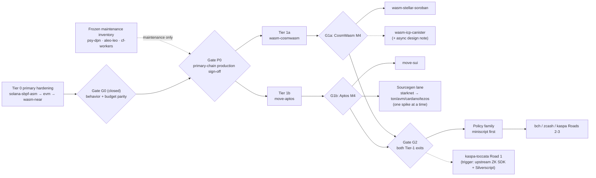

# Target Portfolio Roadmap

Status: **Draft (2026-07)**

This page is the portfolio-level plan for the ~15 docs-first research targets:
which ones to build, in what order, under which preconditions, and which ones
deliberately stay parked. Per-target architecture lives in
[docs/targets/](targets/README.md); this page only sequences them.

Scheduling here is expressed as **gates and dependencies, not dates**: a tier
opens when its precondition gate is met, and within a tier work is sized in
milestones that map one-to-one onto implementing branches.

## Tier model

```text
Tier 0  Primary-chain hardening on main today (Gate P0 closed)
Tier 1  Next: open for scheduling after CLI M3/M4 cleanup
Tier 2  Conditional: opens when its listed enabler lands
Tier 3  Parked research: docs stay current, no registry/code work
```

**Primary-chain completion covenant (D-045):** product implementation capacity
was reserved for the three priority chains, in order:
`solana-sbpf-asm` → `evm` (Ethereum) → `wasm-near` (NEAR/Wasm). These targets
have reached production-grade completeness as of Gate P0. The sign-off ledger
is Gate P0 in [gate-status.md](gate-status.md). After this closure, additional
chain work is no longer blocked by D-045, but the implementation backlog still
puts CLI M3/M4 target-first migration before Tier-1 M3/M4 advancement.

**Tier-0 parity gate (Gate G0, the first required slice of D-045):** the shared
scenarios (Counter and ValueVault) pass in testkit (RFC 0007) on `evm`,
`solana-sbpf-asm`, and `wasm-near`, with per-target resource budgets (RFC 0010):
Solana CU, EVM gas, and NEAR gas. Gate G0 is closed in
[gate-status.md](gate-status.md), which closes the behavior/budget parity
slice. Gate P0 is also closed, so Tier 1 can be scheduled after the remaining
CLI M3/M4 migration work. Every later target reuses the artifacts this work
hardens: the portable IR surface, capability routing, EmitWat, the scenario
harness, target artifact metadata, and budget-as-gate quality signal.

## Tier 0 — primary-chain hardening (closed)

Gate P0 is closed. The first three rows below are the completed primary-chain
hardening targets. The remaining rows are already-landed inventory; they stay
maintenance-only unless a later gate or explicit backlog slice promotes them.

| Target | State |
|---|---|
| `solana-sbpf-asm` | **Primary priority 1.** Production-grade P0-1 signed off; direct assembly, loader-compatible ELF packaging, Pinocchio live CI equivalence, and Surfpool dual-deploy gates are green |
| `evm` | **Primary priority 2.** Production-grade P0-2 signed off; semantic-plan migration landed, with EVM smokes, Foundry, Anvil, and FV-4 trace anchors green |
| `wasm-near` | **Primary priority 3.** Production-grade P0-3 signed off; EmitWat canonical, target-first local execution, artifact/deploy metadata, diagnostics, budget baselines, and CI gates are green |
| `psy-dpn` | Maintenance-only Experimental subset until a new product lane explicitly schedules it |
| `aleo-leo` | Maintenance-only Research spike per D-032 until a new ZK-app lane is scheduled |
| `wasm-cloudflare-workers` | Maintenance-only off-chain host demo (D-033); no product expansion currently scheduled |

### Tier-0 completion checklist (D-044, current focus)

The three priority targets are now signed off. The historical implementation
priority was `solana-sbpf-asm` → `evm` → `wasm-near`; per-gate status is
tracked in [gate-status.md](gate-status.md).

| Item | Target | Status | Owner |
|---|---|---|---|
| Counter behavior parity (3 targets) | all | ✅ met | testkit |
| ValueVault behavior parity (3 targets) | all | ✅ met | testkit |
| Counter budgets `solana_cu`/`evm_gas`/`near_gas` | all | ✅ met | testkit scenarios |
| NEAR gas budget implementation | wasm-near | ✅ met | testkit scenarios |
| ValueVault budget baselines (3 targets) | all | ✅ met | testkit scenarios |
| Gate G0 sign-off | all | ✅ closed | gate-status |
| EVM semantic-plan migration | evm | ✅ met | Workstream 3 / P0-2 |
| Solana Pinocchio CI equivalence | solana | ✅ met | Workstream 7 / P0-1 |
| NEAR target-first local execution/deploy metadata | wasm-near | ✅ met | P0-3 / `just near-target-first` |

Gate G0 and Gate P0 are closed. The next product hardening slice is the CLI
M3/M4 migration from legacy flags to target-first invocations; Tier-1 M3/M4
work should be scheduled after that cleanup unless a higher-priority stability
or security issue appears.

## Tier 1 — next two targets

### 1a. `wasm-cosmwasm` — the EmitWat generality proof

Already settled direction (D-003/D-006): CosmWasm is the first new Wasm
spike. The consolidation strengthened the case — EmitWat now exists, and
`AllocatorConfig` already defines `cosmWasmRegion` as a dormant binding
(RFC 0008). CosmWasm is the cheapest possible second Wasm host:

- Reuses: `Compiler/Wasm/AST+Printer`, EmitWat lowering, allocator model,
  IR coverage manifests, testkit NEAR harness pattern (wasmtime + host shim).
- New work: CosmWasm host import set (`db_read`/`db_write`/…), region
  allocator ABI exports, JSON message encoding for entrypoints,
  `cosmwasm-check` gate, testkit `harness-cosmwasm`.
- Milestones: M1 host-import + region ABI in EmitWat; M2 Counter artifact
  passes `cosmwasm-check`; M3 testkit scenario green + cross-target
  equivalence vs `wasm-near`; M4 registry stage → Experimental.

**Ready for a scheduled M3/M4 slice:** the landed CosmWasm Counter spike (WAT
emitter + smoke + VM lifecycle) may advance after the CLI M3/M4 target-first
cleanup, because Gate P0 has closed.

Exit meaning: if the same EmitWat core serves two Wasm hosts with only
import/ABI adapters swapped, the Wasm-family architecture claim is proven,
and Soroban/ICP become adapter projects instead of research projects.

### 1b. `move-aptos` — the first sourcegen POC (parallel track)

Settled by D-007/D-008 (Aptos before Sui; generated Move source, proofs stay
in Lean). Unlike the Wasm targets it shares no emitter with EmitWat, which is
exactly why it is worth doing early in parallel: it exercises the
portable-IR → *source package* route that Tezos/Cardano/TON/Starknet would
also use, with the most mature tooling of that group.

**Why Aptos before Sui (D-007 rationale, and when to flip it).** The
ordering is a compiler-cost argument, not an ecosystem judgment. Aptos Move
keeps classic Move global storage: a `Counter` resource under an account
address maps almost one-to-one onto the portable IR's state model (scalar
state owned by the contract), so the first IR→Move printer stays small.
Sui removes global storage: state lives in owned/shared **objects** with
UID-based identity, transfer/share semantics, and programmable transaction
blocks — an object model that must be designed as a Target Extension SDK
(the same class of work as Solana's account extensions, D-027) *before* a
faithful Counter can even be expressed. Doing Aptos first splits the risk:
M1–M2 prove "portable IR → Move source → native test gate" with minimal
target-extension design; the Sui object extension then lands on a working
printer. Flip the order only if an ecosystem/product reason outweighs
carrying both risks at once — the technical cost of Sui-first is designing
the object extension concurrently with the first Move printer, and the
schedule cost is that the sourcegen-lane gate (G1b) inherits that extra
design dependency.

- Milestones: M1 IR → Move module printer for the Counter subset (scalar
  state, entrypoints, events); M2 `aptos move test` gate + golden fixture;
  M3 testkit integration (CLI-wrapped executor); M4 capability matrix row
  flips from planned to validated; Sui follows only after Aptos exits.

**Ready for a scheduled M3/M4 slice:** the landed Aptos Move Counter sourcegen
spike (printer + golden + `aptos move compile/test` gate + state-id fidelity
B1) may advance after the CLI M3/M4 target-first cleanup. `move-sui` still
waits for Aptos M4.

## Tier 2 — conditional targets (enabler listed per target)

| Target | Enabler (gate) | Marginal work once enabled | Recommendation |
|---|---|---|---|
| `wasm-stellar-soroban` | CosmWasm M4 (proves host-adapter split) | Soroban host imports, XDR/contract-spec ABI, storage TTL model as target metadata, Stellar CLI gate | Do after CosmWasm; second-cheapest Wasm host |
| `wasm-icp-canister` | CosmWasm M4 **plus** an async/inter-canister design note | Candid ABI, update/query split, cycles metadata; its async call model does not fit the current synchronous IR effect set | Defer; hardest Wasm host — do not start on adapter momentum alone |
| `move-sui` | Aptos M4 | Object model as target extension (parallel to Solana accounts), Sui CLI gates | Follows Aptos per D-007 |
| `starknet-cairo` | Aptos M4 (sourcegen pattern proven) + one maintainer with Cairo depth | Cairo/Scarb package printer, Sierra/CASM artifact + class-hash metadata | First non-Move sourcegen candidate; ZK-adjacent knowledge partially shared with Psy/Aleo |
| `ton-tvm`, `algorand-avm`, `cardano-plutus-aiken`, `tezos-michelson-ligo` | Starknet or equivalent second sourcegen exit | Each is a source-package printer + native-CLI gate on the same pattern | Keep docs current; pick **at most one at a time**, chosen by ecosystem demand, not architecture need |

Rule for the sourcegen research lane (worth keeping from the decision log):
one active sourcegen spike at a time. Every target in this lane uses the same
skeleton — restricted portable IR subset → generated source package → native
toolchain gate → testkit CLI-wrapped executor — so parallel spikes duplicate
learning instead of accelerating it.

## Tier 3 — the Bitcoin/UTXO family: a different product, same platform

`bitcoin-script-miniscript`, `bch-cashscript`, `zcash-shielded`, and
`kaspa-toccata` are **not smart-contract execution targets** and must not be
routed through the contract pipeline. The honest architectural fit (already
sketched in [bitcoin-script-miniscript](targets/bitcoin-script-miniscript.md),
D-021/D-022, and the review checklist) is a separate **policy family**:

```text
Contract family (today):
  Intent API -> ContractSpec/IR -> capability routing -> execution artifact

Policy family (Bitcoin lane, when opened):
  Policy Intent API (pure spending predicates: signatures, thresholds,
  hash preimages, absolute/relative timelocks, Taproot script paths)
    -> policy IR (no storage, no events, no crosscall, no entrypoints —
       a predicate tree, not a program)
    -> Miniscript / descriptor generation (rust-miniscript)
    -> Script / Tapscript artifact + PSBT scenario manifest
    -> Bitcoin Core regtest / testmempoolaccept gate (testkit CLI executor)
```

Design consequences to record when this lane opens:

- **New capability domain, not reuse:** `policy.*` ids (e.g. `policy.sig`,
  `policy.threshold`, `policy.timelock.absolute`, `policy.hashlock`,
  `policy.taproot_path`) instead of pretending `storage.*`/`events.emit`
  apply. The capability registry gains a policy section; contract-family
  capabilities are all `—` (not applicable) for these targets.
- **Lean's value is different here:** not state-machine proofs but policy
  properties — "funds are recoverable after timelock T along some path",
  "no spending path omits participant X", miniscript-level non-malleability
  conditions. These are decidable checks over a small predicate tree:
  well-suited to the FV roadmap style (decide-checked theorems).
- **What ProofForge adds over raw Miniscript:** one verified policy source
  that emits Bitcoin descriptors *and* (later) BCH CashScript or Kaspa
  covenant forms, with the same cross-target equivalence testing testkit
  gives contracts.
- **Zcash ordering:** `zcash-shielded` stays behind
  `bitcoin-script-miniscript` — it adds a proving/nullifier boundary on top
  of the same UTXO policy shape (D-022) and should inherit a working policy
  lane first.

### Kaspa Toccata: straddles the policy lane and the ZK lane

`kaspa-toccata` deserves its own entry rather than one line in the Bitcoin
family, because its situation changed: **the Toccata hardfork activated on
Kaspa mainnet ~2026-06-30** (rusty-kaspa v2.0.0), shipping native L1
covenants, transaction v1 (`covenant` outputs, `compute_commit` inputs,
per-input compute budgets), KIP-16 ZK verifier opcodes, and KIP-21
partitioned sequencing commitments for based ZK apps. The
[target note](targets/kaspa-toccata.md) already splits it into three roads,
and they belong to two different ProofForge lanes:

- **Road 1 (L1 covenant app)** is UTXO policy-family work: covenant lineage
  + successor-output validation over a predicate-tree-like policy IR. It
  shares the policy IR investment with `bitcoin-script-miniscript`, but is
  *more* expressive (stateful covenant lineage), so miniscript remains the
  simpler proving ground first.
- **Roads 2–3 (inline ZK covenant, based-app settlement)** are strategically
  distinctive for ProofForge specifically: a proof-first platform emitting
  covenant packages whose *on-chain verification is itself proof-based*
  (Noir/Groth16 inline; RISC Zero/SP1 for based apps) lines up with the
  Lean-proof story and the ZK experience from `psy-dpn`/`aleo-leo`. No other
  target in the portfolio has this shape.

**Trigger:** upstream's announced second-phase release (SMT RPC API, ZK SDK,
first Silverscript version). When that ships, re-review D-012 and schedule
the Road 1 spike (Silverscript-based, tiny covenant Counter with successor
validation) — it may open at Gate G2 together with miniscript rather than
strictly behind it, since mainnet activation removed the
"semantics not stable upstream" blocker. Roads 2–3 stay research until
Road 1 exits.

**Recommendation:** keep the whole family parked until both Tier-1 targets
exit. When opened, `bitcoin-script-miniscript` goes first, as a deliberately
small vertical: policy IR + rust-miniscript emission + regtest gate, Counter
has no meaning here — the shared scenario for the policy family is a 2-of-3
multisig with a timelock recovery path.

## Coverage audit: researched vs not researched

Every chain with a `docs/targets/` note is placed in a tier above: EVM,
Solana, NEAR, CosmWasm, Soroban, ICP, Cloudflare Workers, Aptos, Sui,
Starknet, TON, Algorand, Cardano, Tezos, Aleo, Psy/DPN, Bitcoin
Script/Miniscript, BCH CashScript, Zcash, Kaspa Toccata, plus the research-only
Polkadot/ink!. Chains that have come up in discussion but have **no research
note yet** — they need a docs-first target note (D-012-style) before any tier
placement:

- **Casper Network (`casper`, CSPR)** — Wasm-based chain with upgradeable
  contracts and the Odra framework; architecturally it would join the
  Wasm-host family behind CosmWasm/Soroban if researched. Not in the current
  portfolio; add a target note first if wanted.
- EVM-compatible L2s/chains are intentionally *not* individual targets —
  they are chain profiles under `evm` (D-024 pattern).

## Explicit non-plans

- `wasm-polkadot` / ink! stays research-only (D-009) — revisit only on
  concrete demand.
- No new chain profile targets beyond `evm` reuse (D-024 pattern) need
  planning; EVM-compatible chains are metadata, not backends.
- The cloud platform remains gated by D-010 (two-plus targets at
  Experimental with shared-scenario parity), unchanged by this roadmap.

## Sequencing summary (gates, not dates)



```text
Gate G0: behavior + budget parity on evm/solana/wasm-near   (closed slice)
Gate P0: production sign-off for solana-sbpf-asm -> evm -> wasm-near  (closed)
  ├── after CLI M3/M4: schedule 1a wasm-cosmwasm  (M3..M4)
  └── after CLI M3/M4: schedule 1b move-aptos     (M3..M4, parallel)
Gate G1a: cosmwasm M4  -> opens wasm-stellar-soroban; ICP needs +async design note
Gate G1b: aptos M4     -> opens move-sui; opens sourcegen lane (starknet first pick)
Gate G2:  both Tier-1 exits -> opens Bitcoin policy family (miniscript first)
Kaspa trigger: upstream phase-2 release (ZK SDK + Silverscript) -> re-review
  D-012; Road 1 may open alongside miniscript at G2; Roads 2-3 after Road 1
Sourcegen lane rule: at most one active spike at a time
```

Tracked as Workstream 28 in the
[implementation backlog](implementation-backlog.md); tiering and the policy
family classification recorded as D-034 in [decisions](decisions.md).
