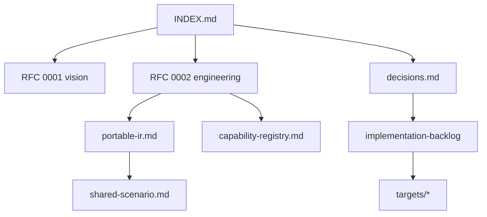

# ProofForge 文档索引

ProofForge 是一个 Lean 优先的多链智能合约平台。当前仓库包含 EVM 后端基线，以及将编译器、SDK、测试运行器和部署面扩展到其他链的设计路线。

**当前阶段：** Phase 0 已完成（EVM 基线）；Phase 1 进行中（目标注册表、可移植 IR、制品元数据）。

## 文档地图

| 如果你是... | 从这里开始 | 然后阅读 |
|---|---|---|
| 新贡献者 | 本页面 + [README](../README.md) | [EVM 目标说明](targets/evm.md), [待办事项](implementation-backlog.md) |
| 实现后端 | [RFC 0002](rfcs/0002-target-implementation-design.md) | [决策](decisions.md), [可移植 IR](portable-ir.md), 目标说明 |
| 评审设计 | [评审清单](review-checklist.md) | RFCs, [能力注册表](capability-registry.md), [共享场景](shared-scenario.md) |
| 策略 / 中文读者 | [zh/README](zh/README.md) | [可行性分析](zh/feasibility-analysis.md), [决策](decisions.md) |

## 规格与决策

- [设计决策](decisions.md)：确定的架构选择和路线图摘要。
- [可移植合约 IR](portable-ir.md)：IR 草案和阶段 1 验收标准。
- [RFC 0003: 可移植 IR 与运行时](rfcs/0003-portable-ir-and-runtime.md)：详细的 IR/能力/运行时草案。
- [能力注册表](capability-registry.md)：规范的能力 id。
- [共享场景：计数器](shared-scenario.md)：跨目标验收测试。

## RFC

已接受的工程方向 ([rfcs/README](rfcs/README.md))：

- [RFC 0001: Lean 优先的多链合约平台](rfcs/0001-multichain-platform.md)
- [RFC 0002: 目标实现设计](rfcs/0002-target-implementation-design.md)
- [RFC 0003: 可移植 IR 与运行时 profile](rfcs/0003-portable-ir-and-runtime.md) (草案 — 扩展 0001/0002)

## 工程

- [开发标准](development-standards.md)：贡献者规则和单一真值源映射。
- [开发日志](development-log.md)：带有验证说明和后续步骤的里程碑日志。
- [验证门禁](validation-gates.md)：可运行的门禁和工具先决条件。
- [实现待办事项](implementation-backlog.md)：分阶段任务和验收标准。
- [评审清单 (英文)](review-checklist.md)
- [目标笔记](targets/README.md)：各家族的 Research 和 spike 计划。
  - [EVM](targets/evm.md)
  - [Wasm 家族](targets/wasm-family.md)
  - [Stellar Soroban 目标](targets/stellar-soroban.zh.md)
  - [Internet Computer 目标](targets/internet-computer.zh.md)
  - [Algorand AVM 目标](targets/algorand-avm.zh.md)
  - [Solana sBPF](targets/solana-sbf.md) (`solana-sbpf-linker`)
  - [Move 家族](targets/move-family.md)
  - [Cardano Plutus/Aiken 目标](targets/cardano-plutus-aiken.zh.md)
  - [Tezos Michelson/LIGO 目标](targets/tezos-michelson-ligo.zh.md)
  - [Starknet Cairo 目标](targets/starknet-cairo.zh.md)
  - [Aleo Leo 目标](targets/aleo-leo.zh.md)
  - [TON TVM 目标](targets/ton-tvm.zh.md)
  - [Bitcoin Script/Miniscript 目标](targets/bitcoin-script-miniscript.zh.md)
  - [Zcash Shielded 目标](targets/zcash-shielded.zh.md)
  - [Bitcoin Cash CashScript 目标](targets/bitcoin-cash-cashscript.zh.md)
  - [Psy DPN ZK 目标](targets/psy-dpn.md)
  - [Kaspa Toccata 目标](targets/kaspa-toccata.zh.md)

## 中文笔记

- [中文文档索引](zh/README.md)
- [多链愿景可行性分析](zh/feasibility-analysis.md)
- [多链技术实现方案](zh/technical-implementation-plan.md) — 摘要；工程细节见 RFC 0002
- [多链方案 Review 清单](zh/review-checklist.md)
- [Psy/DPN ZK Target 初步分析](zh/zk-psy-target-analysis.md)
- [Kaspa Toccata 目标说明](zh/targets/kaspa-toccata.zh.md)
- [Stellar Soroban 目标说明](zh/targets/stellar-soroban.zh.md)
- [Internet Computer 目标说明](zh/targets/internet-computer.zh.md)
- [Cardano Plutus/Aiken 目标说明](zh/targets/cardano-plutus-aiken.zh.md)
- [Tezos Michelson/LIGO 目标说明](zh/targets/tezos-michelson-ligo.zh.md)
- [Starknet Cairo 目标说明](zh/targets/starknet-cairo.zh.md)
- [Aleo Leo 目标说明](zh/targets/aleo-leo.zh.md)
- [Aleo Leo 设计规格](zh/superpowers/specs/2026-07-01-aleo-leo-design.zh.md)
- [TON TVM 目标说明](zh/targets/ton-tvm.zh.md)
- [Bitcoin Script/Miniscript 目标说明](zh/targets/bitcoin-script-miniscript.zh.md)
- [Zcash Shielded 目标说明](zh/targets/zcash-shielded.zh.md)
- [Bitcoin Cash CashScript 目标说明](zh/targets/bitcoin-cash-cashscript.zh.md)

## 当前实现基线

- EVM 合约使用 `ProofForge.Evm` (`open Lean.Evm`)。
- `proof-forge --evm-bytecode` 通过 LCNF、Yul 和 `solc --strict-assembly` 编译 Lean 合约。
- `scripts/evm/foundry-smoke.sh` 使用 Foundry 的本地 EVM 测试运行器验证生成的运行时字节码。
- 目标注册表、代码中的可移植 IR 以及 `proof-forge-artifact.json` 已在计划中 (阶段 1) — 参见 [实现待办事项](implementation-backlog.md)。
