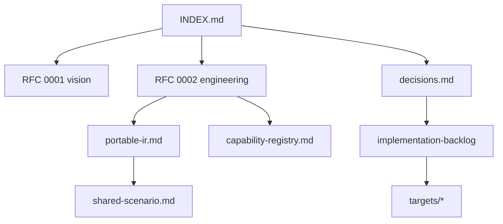

# ProofForge 文档索引

ProofForge 是一个 Lean 优先的多链智能合约平台。在 2026-07 分支合并后，主干包含 EVM 基线，以及 Solana (sBPF 汇编)、NEAR (EmitWat)、Sui (Counter MVP)、CosmWasm 和 Aptos (Counter spike)、Psy/DPN、Aleo Leo 和 Cloudflare Workers (TypeScript spike) 后端，统一位于一个可移植 IR 和能力注册表之下。

**当前阶段：** 三个主要产品链的 Gate P0 已关闭：`solana-sbpf-asm`、`evm` 和 `wasm-near`。下一个加固路径是从旧版标志到 `proof-forge build|emit|check --target ...` 的 CLI M3/M4 迁移；Tier-1 M3/M4 工作在该清理工作完成后进行。

## 文档地图

| 如果你是…… | 从这里开始 | 然后阅读 |
|---|---|---|
| 新贡献者 | 本页面 + [README](../README.md) + [Onboarding](onboarding.md) | [可移植三目标教程](tutorials/portable-contract-three-targets.md), [验证 gate](validation-gates.md), [待办事项](implementation-backlog.md) |
| 实现后端 | [RFC 0002](rfcs/0002-target-implementation-design.md) | [决策](decisions.md), [可移植 IR](portable-ir.md), 目标笔记 |
| 评审设计 | [评审清单](review-checklist.md) | RFCs, [能力注册表](capability-registry.md), [共享场景](shared-scenario.md) |
| 策略 / 中文读者 | [zh/README](zh/README.md) | [可行性分析](zh/feasibility-analysis.md), [决策](decisions.md) |

## 架构图 (Excalidraw)

用于演示和入职培训的可编辑手绘风格图表 —— 可在 [excalidraw.com](https://excalidraw.com) 或使用编辑器内的 Excalidraw 插件打开：

- [图表目录](diagrams/README.md) —— 七个 `.excalidraw` 文件，涵盖平台概览、编译流水线、多目标 Counter、能力路由、开发者工作流、代码库布局和目标全景。

## 规格与决策

- [设计决策](decisions.md)：确定的架构选择和路线图摘要。
- [可移植合约 IR](portable-ir.md)：IR 草图和第一阶段验收标准。
- [RFC 0003: 可移植 IR 与运行时](rfcs/0003-portable-ir-and-runtime.md)：详细的 IR/能力/运行时草案。
- [RFC 0004: EVM 语义计划与 Yul AST 边界](rfcs/0004-evm-semantic-plan.md)：位于可移植 IR 与低层 Yul 语法之间的目标语义 EVM 计划层。
- [能力注册表](capability-registry.md)：规范的能力 id。
- [共享场景：Counter](shared-scenario.md)：跨目标验收测试。
- [文档↔代码同步审计 (2026-07)](doc-code-sync-audit-2026-07.md)：偏差登记和维护清单。
- [教程：一个模块，三个目标](tutorials/portable-contract-three-targets.md)：可移植 `contract_source` 演练 (CS-5.3)。

## RFCs

已接受的工程方向 ([rfcs/README](rfcs/README.md))：

- [RFC 0001: Lean 优先的多链合约平台](rfcs/0001-multichain-platform.md)
- [RFC 0002: 目标实现设计](rfcs/0002-target-implementation-design.md)
- [RFC 0003: 可移植 IR 与运行时 profile](rfcs/0003-portable-ir-and-runtime.md) (草案 —— 扩展 0001/0002)
- [RFC 0004: EVM 语义计划与 Yul AST 边界](rfcs/0004-evm-semantic-plan.md) (草案 —— EVM 后端内部架构)
- [RFC 0005: Solana sBPF 汇编后端](rfcs/0005-solana-sbpf-assembly-backend.md) (已接受 —— 规范的 Solana 路径，D-026)
- [RFC 0006: 多链 Token SDK](rfcs/0006-multichain-token-sdk.md) (草案)
- [RFC 0007: 统一的 Rust 测试框架](rfcs/0007-unified-rust-test-framework.md) (草案 —— 基于 revm/Mollusk/wasmtime 的 testkit 场景)
- [RFC 0008: 链解耦的分配器抽象](rfcs/0008-allocator-abstraction.md) (草案 —— 每个目标绑定一个分配器模型)

## 工程

- [开发标准](development-standards.md)：贡献者规则和单一真值源地图。
- [入职指南](onboarding.md)：本地设置路径、编辑器说明以及针对新贡献者的最小验证循环。
- [Quint 模型生成](quint.md)：从可移植 IR 发射可执行状态机模型，进行模拟、模型检查并重放 MBT 追踪。
- [开发日志](development-log.md)：带有验证说明和后续步骤的里程碑日志。
- [编写模型](authoring-model.md)：学习 source、`contract_source` 以及内部 `ContractSpec` 边界。
- [验证门禁](validation-gates.md)：可运行的门禁和工具先决条件。
- [形式化验证路线图](formal-verification.md)：现有的形式化锚点和阶段性证明目标。
- [目标组合路线图](target-roadmap.md)：剩余 Research 目标和 Bitcoin 策略家族 (D-034) 的分层排序。
- [平台差距分析 2026-07](platform-gaps-2026-07.md)：未计划的维度（CLI 界面、版本控制、预算、升级/签名、错误模型、客户端）及其排序钩子。
- [实现待办事项](implementation-backlog.md)：阶段性任务和验收标准。
- [评审清单 (英语)](review-checklist.md)
- [目标说明](targets/README.md)：各家族的 Research 和 spike 计划。
  - [EVM](targets/evm.md)
  - [Wasm 家族](targets/wasm-family.md)
  - [Wasm-NEAR](targets/wasm-near.md)
  - [Cloudflare Workers 目标](targets/cloudflare-workers.md)
  - [Stellar Soroban 目标](targets/stellar-soroban.md)
  - [Internet Computer 目标](targets/internet-computer.md)
  - [Algorand AVM 目标](targets/algorand-avm.md)
  - [Solana sBPF Asm](targets/solana-sbpf-asm.md) (规范的直接汇编路线)
  - [Solana sBPF](targets/solana-sbf.md) (已取代的 Zig/sbpf-linker 路线)
  - [Move 家族](targets/move-family.md)
  - [Cardano Plutus/Aiken 目标](targets/cardano-plutus-aiken.md)
  - [Tezos Michelson/LIGO 目标](targets/tezos-michelson-ligo.md)
  - [Starknet Cairo 目标](targets/starknet-cairo.md)
  - [Aleo Leo 目标](targets/aleo-leo.md)
  - [Aleo Leo 设计规范](superpowers/specs/2026-07-01-aleo-leo-design.md)
  - [TON TVM 目标](targets/ton-tvm.md)
  - [Bitcoin Script/Miniscript 目标](targets/bitcoin-script-miniscript.md)
  - [Zcash Shielded 目标](targets/zcash-shielded.md)
  - [Bitcoin Cash CashScript 目标](targets/bitcoin-cash-cashscript.md)
  - [Psy DPN ZK 目标](targets/psy-dpn.md)
  - [Kaspa Toccata 目标](targets/kaspa-toccata.md)

## 中文说明

- [中文文档索引](zh/README.md)
- [架构评审 2026-07：统一 SDK 输入与分支收敛](zh/architecture-review-2026-07.md)
- [多链愿景可行性分析](zh/feasibility-analysis.md)
- [多链技术实现方案](zh/technical-implementation-plan.md) — 摘要；工程细节见 RFC 0002
- [多链方案 Review 清单](zh/review-checklist.md)
- [Psy/DPN ZK Target 初步分析](zh/zk-psy-target-analysis.md)

## 当前实现基线

- 目标注册表 (`ProofForge/Target/Registry.lean`)、可移植 IR (`ProofForge/IR/Contract.lean`)、能力路由以及 `proof-forge-artifact.json` 发射已实现。
- EVM：`proof-forge build --target evm` 通过可移植 IR、EVM 语义计划、Yul 和 `solc --strict-assembly` 编译 `contract_source` 模块。Foundry 和 Anvil 冒烟测试验证运行时行为。
- Solana：`proof-forge emit --target solana-sbpf-asm --format s|elf` 发射 sBPF 汇编和 ELF 包，由 Mollusk、Surfpool/Rust 和 Pinocchio 等效性门禁验证。
- NEAR：`proof-forge emit|build --target wasm-near --format wat` 通过 Wasm AST 将可移植 IR 降级为 WAT，并带有形式化追踪义务 (`Tests/NearWasmFormal.lean`)、目标优先的制品元数据以及离线宿主冒烟测试。
- Psy/DPN、Aleo Leo 和 Cloudflare Workers 从可移植 IR 固定装置发射目标源代码；各门禁的工具先决条件请参见 [validation-gates.md](validation-gates.md)。
