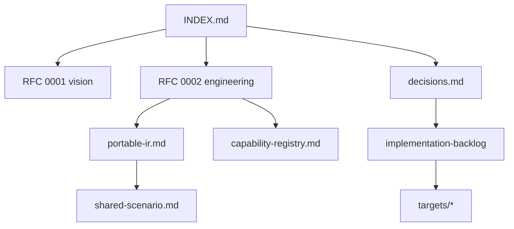

# ProofForge 文档索引

ProofForge 是一个 Lean 优先的多链智能合约平台。主干包含 EVM 基准，以及 Solana (sBPF 汇编)、NEAR (EmitWat)、Sui (Counter MVP)、CosmWasm 和 Aptos (Counter spikes)、Psy/DPN、Aleo Leo 和 Cloudflare Workers (TypeScript spike) 后端，它们统一在同一个可移植 IR 和能力注册表之下，遵循 2026-07 分支合并。

**当前阶段：** Gate P0 和 [2026-07-10 多链差异审计](multi-chain-gap-audit-2026-07-10.md) 修复 (PF-P0…P3) 已关闭。当前执行的是 [评审后深化三元组计划](superpowers/plans/2026-07-10-post-review-execution.md)：NEAR/EVM/Solana 产品深度、平台债务 (CLI M4、版本控制、升级) 以及诚实的 FV 片段增长 —— **而非**次要链晋级。

## 文档地图

| 如果你是…… | 从这里开始 | 然后阅读 |
|---|---|---|
| 新贡献者 | 本页面 + [README](../README.md) + [入职指南](onboarding.md) | [可移植三目标教程](tutorials/portable-contract-three-targets.md), [验证门禁](validation-gates.md), [待办事项](implementation-backlog.md) |
| 实现后端 | [RFC 0002](rfcs/0002-target-implementation-design.md) | [决策](decisions.md), [可移植 IR](portable-ir.md), 目标笔记 |
| 评审设计 | [评审清单](review-checklist.md) | RFCs, [能力注册表](capability-registry.md), [共享场景](shared-scenario.md) |
| 策略 / 中文读者 | [zh/README](zh/README.md) | [可行性分析](zh/feasibility-analysis.md), [决策](decisions.md) |

## 架构图 (Excalidraw)

用于演示和入职培训的可编辑手绘风格图表 —— 可在 [excalidraw.com](https://excalidraw.com) 或编辑器内通过 Excalidraw 插件打开：

- [图表目录](diagrams/README.md) —— 七个 `.excalidraw` 文件，涵盖平台概览、编译流水线、多目标 Counter、能力路由、开发人员工作流、代码库布局和目标全景。

## 规范与决策

- [设计决策](decisions.md)：确定的架构选择和路线图摘要。
- [可移植合约 IR](portable-ir.md)：IR 草图和第一阶段验收标准。
- [RFC 0003: 可移植 IR 和运行时](rfcs/0003-portable-ir-and-runtime.md)：详细的 IR/能力/运行时草案。
- [RFC 0004: EVM 语义计划和 Yul AST 边界](rfcs/0004-evm-semantic-plan.md)：位于可移植 IR 和低级 Yul 语法之间的目标语义 EVM 计划层。
- [能力注册表](capability-registry.md)：规范的能力 id。
- [宿主 · 协议 · 标准库 (A/B/C)](protocols-layer.md)：链运行时 vs 链上程序客户端 vs 可部署标准库。
- [**产品 SDK** (作者路径)](product-sdk.md)：你唯一需要的界面 —— 意图 → `--target` → 制品。
- [产品 / SDK 差距计划 (2026-07)](product-sdk-gap-plan-2026-07.md)：差距与波次 α–ε。

- [宿主运行时抽象](host-runtime.md)：可移植 HostEffect → EVM 操作码 / Solana 系统调用 / NEAR 宿主导入。
- [多链修复 Agent 目标](agent-goal-prompt.md)：历史 PF-P0…P3 完成账本（不要重新打开已关闭的行）。
- [评审后执行计划 (2026-07-10)](superpowers/plans/2026-07-10-post-review-execution.md)：**活跃**队列 —— 深化核心三元组、平台债务、FV 片段。
- [共享场景：Counter](shared-scenario.md)：跨目标验收测试。
- [文档↔代码同步审计 (2026-07)](doc-code-sync-audit-2026-07.md)：偏差登记和维护清单。
- [教程：一个模块，三个目标](tutorials/portable-contract-three-targets.md)：可移植 `contract_source` 演练 (CS-5.3)。
- [教程：从零开始的共享路径](tutorials/portable-shared-path.md)：Counter → Ownable → Token → Remote (`just product`, T4.2)。
- [示例与测试分类](examples-and-tests-taxonomy.md)：产品 vs 后端 vs IR。

## RFCs

已接受的工程方向 ([rfcs/README](rfcs/README.md))：

- [RFC 0001: Lean 优先的多链合约平台](rfcs/0001-multichain-platform.md)
- [RFC 0002: 目标实现设计](rfcs/0002-target-implementation-design.md)
- [RFC 0003: 可移植 IR 和运行时 profile](rfcs/0003-portable-ir-and-runtime.md) (草案 —— 扩展 0001/0002)
- [RFC 0004: EVM 语义计划和 Yul AST 边界](rfcs/0004-evm-semantic-plan.md) (草案 —— EVM 后端内部架构)
- [RFC 0005: Solana sBPF 汇编后端](rfcs/0005-solana-sbpf-assembly-backend.md) (已接受 —— 规范的 Solana 路径，D-026)
- [RFC 0006: 多链 Token SDK](rfcs/0006-multichain-token-sdk.md) (草案)
- [RFC 0007: 统一 Rust 测试框架](rfcs/0007-unified-rust-test-framework.md) (草案 —— 基于 revm/Mollusk/wasmtime 的测试套件场景)
- [RFC 0008: 链解耦的分配器抽象](rfcs/0008-allocator-abstraction.md) (草案 —— 每个目标绑定一个分配器模型)

## 工程- [开发标准](development-standards.md)：贡献者规则和单一事实来源地图。
- [新手入门](onboarding.md)：本地设置路径、编辑器说明以及针对新贡献者的最小验证循环。
- [Quint 模型生成](quint.md)：从可移植 IR 发射可执行状态机模型，进行模拟、模型检查并重放 MBT 追踪。
- [开发日志](development-log.md)：带有验证说明和后续步骤的里程碑日志。
- [编写模型](authoring-model.md)：学习 source、`contract_source` 以及内部 `ContractSpec` 边界。
- [验证门控](validation-gates.md)：可运行的门控和工具先决条件。
- [形式化验证路线图](formal-verification.md)：现有的形式化锚点和阶段性证明目标。
- [Solana sBPF 可执行追踪](solana-sbpf-executable-trace.md)：Lean 内置的 Counter + ValueVault 标量/事件，以及用于直接 sBPF 汇编的 fixed-array/u64-map 存储目标语义。
- [可移植 IR 语义锚点](portable-ir-semantics-anchor.md)：多链规则 —— IR.Semantics 是唯一的形式化来源；禁止绕过 IR。
- [Solana sBPF ↔ solanalib 桥接](solana-sbpf-solanalib-bridge.md)：Scheme 1 编码 + Scheme 2 标记/提升 + Counter 核心-尾部宿主桥接 + 可选的 CompileCorrect。
- [EVM Yul 子集 ↔ IR 宿主桥接](evm-yul-host-bridge.md)：无 mathlib 的 IR↔YulSemantics 配对模拟（Counter + ValueVault）。
- [WASM 可执行追踪](wasm-executable-trace.md)：Lean 内置的 Counter + ValueVault 标量/事件，以及用于 EmitWat/NEAR 的 fixed-array/u64-map 存储目标语义。
- [目标组合路线图](target-roadmap.md)：剩余 Research 目标和 Bitcoin 策略家族 (D-034) 的分层排序。
- [平台差距分析 2026-07](platform-gaps-2026-07.md)：未计划的维度（CLI 界面、版本控制、预算、升级/签名、错误模型、客户端）及其排序钩子。
- [多链愿景差距审计 (2026-07-10)](multi-chain-gap-audit-2026-07-10.md)：代码支持的目标状态、优先发现、修复浪潮和验收门控。
- [实现积压工作](implementation-backlog.md)：阶段性任务和验收标准。
- [产品编写架构](product-authoring-architecture.md)：业务意图 vs 链具象化；阶段 A–C 状态。
- [可移植 SDK 统一计划 (2026-07-09)](superpowers/plans/2026-07-09-portable-sdk-unification.md)：**已完成** (策略 · Token · 远程 · 编写优化)。
- [统一支持路线图 (2026-07-09)](superpowers/plans/2026-07-09-unified-support-roadmap.md)：先前的统一浪潮（历史背景；未完成的 U4/U6 已被评审后执行计划吸收）。
- [评审后执行计划 (2026-07-10)](superpowers/plans/2026-07-10-post-review-execution.md)：**活跃** — S0 trunk · N1 NEAR · E1 EVM · L1 Solana · **B1 benchmarks** · **Z1 Psy DPN** · **Z2 Aleo Instructions** · P1 平台 · F1 FV · D1 DX。
- [基准测试 (PF vs 原生)](benchmarks.md)：B1 Counter 矩阵 (PF+原生运行器、行为门控、成本表) —— 无虚假跨链评分。快照：[generated/benchmark-counter.md](generated/benchmark-counter.md)。
- [CLI M4 遗留清单](cli-m4-legacy-inventory.md)：别名删除前的 EmitMode/flag 动物园清单。
- [CLI M4 删除检查清单](cli-m4-deletion-checklist.md)：有序删除步骤（兼容窗口）。
- [RFC 0012 版本控制](rfcs/0012-versioning-and-compatibility-policy.md) + `just versioning-policy`。
- [升级/签名操作 (RFC 0013)](upgrade-signing-ops.md)：未签名发射 + 实时门控密钥约定。
- [客户端 Schema 一致性 (U6.4)](client-schema-parity.md)：入口名称 + assertionId 目录。
- [可移植错误词汇表 (P1.6)](portable-error-vocabulary.md)：共享的 assertionId / errorByAssertionId 合约。
- [评审检查清单 (英文)](review-checklist.md)
- [目标说明](targets/README.md)：每个家族的 Research 和 spike 计划。
  - [EVM](targets/evm.md)
  - [Wasm 家族](targets/wasm-family.md)
  - [Wasm-NEAR](targets/wasm-near.md)
  - [Cloudflare Workers 目标](targets/cloudflare-workers.md)- [Stellar Soroban 目标](targets/stellar-soroban.md)
  - [Internet Computer 目标](targets/internet-computer.md)
  - [Algorand AVM 目标](targets/algorand-avm.md)
  - [Solana sBPF Asm](targets/solana-sbpf-asm.md) (规范的直接汇编路径)
  - [Solana sBPF](targets/solana-sbf.md) (已废弃的 Zig/sbpf-linker 路径)
  - [Move 目标家族](targets/move-family.md)
  - [Cardano Plutus/Aiken 目标](targets/cardano-plutus-aiken.md)
  - [Tezos Michelson/LIGO 目标](targets/tezos-michelson-ligo.md)
  - [Starknet Cairo 目标](targets/starknet-cairo.md)
  - [Aleo Leo 目标](targets/aleo-leo.md)
  - [Aleo Leo 设计规范](superpowers/specs/2026-07-01-aleo-leo-design.md)
  - [TON TVM 目标](targets/ton-tvm.md)
  - [Bitcoin Script/Miniscript 目标](targets/bitcoin-script-miniscript.md)
  - [Zcash Shielded 目标](targets/zcash-shielded.md)
  - [Bitcoin Cash CashScript 目标](targets/bitcoin-cash-cashscript.md)
  - [Psy DPN ZK 目标](targets/psy-dpn.md)
  - [Kaspa Toccata 目标](targets/kaspa-toccata.md)

## 中文说明

- [中文文档索引](zh/README.md)
- [架构评审 2026-07：统一 SDK 输入与分支收敛](zh/architecture-review-2026-07.md)
- [全量代码 + 架构评审 2026-07（FV-5 能力门分支）](zh/code-review-2026-07-fv5-capability-gate.md) — 实现正确性与 FV 可靠性
- [执行任务清单 + WASM 家族与调用层规划 2026-07](zh/execution-plan-2026-07.md) — 分轨任务、WASM 新链模板、调用文档生成
- [多链愿景可行性分析](zh/feasibility-analysis.md)
- [多链技术实现方案](zh/technical-implementation-plan.md) — 摘要；工程细节见 RFC 0002
- [多链方案 Review 清单](zh/review-checklist.md)
- [Psy/DPN ZK Target 初步分析](zh/zk-psy-target-analysis.md)

## 当前实现基线

- 目标注册表 (`ProofForge/Target/Registry.lean`)、可移植 IR (`ProofForge/IR/Contract.lean`)、能力路由以及 `proof-forge-artifact.json` 发射已实现。
- EVM：`proof-forge build --target evm` 通过可移植 IR、EVM 语义计划、Yul 和 `solc --strict-assembly` 编译 `contract_source` 模块。Foundry 和 Anvil 冒烟测试验证了运行时行为。
- Solana：`proof-forge emit --target solana-sbpf-asm --format s|elf` 发射 sBPF 汇编和 ELF 包，通过 Mollusk、Surfpool/Rust 和 Pinocchio 等效性门控进行验证。
- NEAR：`proof-forge emit|build --target wasm-near --format wat` 通过 Wasm AST 将可移植 IR 降级为 WAT，包含形式化追踪义务 (`Tests/NearWasmFormal.lean`)、目标优先的元数据以及离线宿主冒烟测试。
- Psy/DPN、Aleo Leo 和 Cloudflare Workers 从可移植 IR 固定装置发射目标源代码；各门控的工具先决条件请参见 [validation-gates.md](validation-gates.md)。
