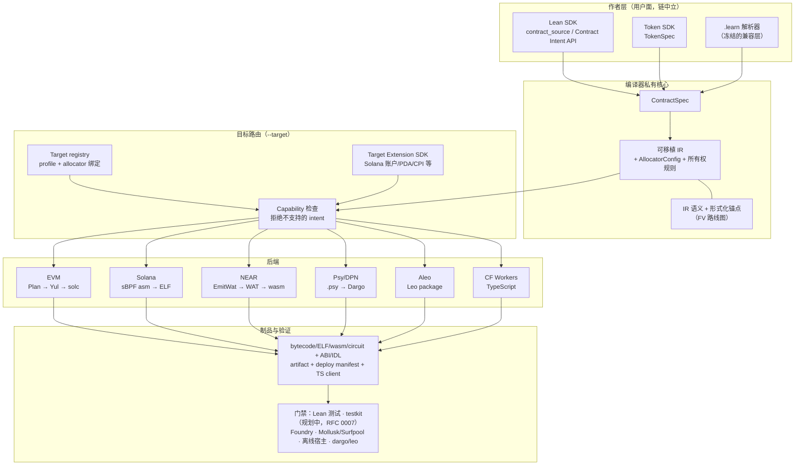

# ProofForge

Lean 优先的多链智能合约平台。

ProofForge 的目标是：一份经过验证的 Lean 合约代码库，可以在多个区块链目标家族
中编译、测试和部署。合约面向链中立的 Contract Intent API 编写；编译器将其降级
为可移植 IR，按目标做 capability 路由，并产出链原生制品。目标不支持的能力会在
编译期被拒绝，而不是静默改变语义。

入口文档：

- [docs/INDEX.md](../INDEX.md) — 完整文档地图。
- [RFC 0001](../rfcs/0001-multichain-platform.md) — 多链架构与路线图；
  [RFC 0002](../rfcs/0002-target-implementation-design.md) — 目标实现设计。
- [Design decisions](../decisions.md) — 已定决策（D-001…D-045）。
- [形式化验证路线图](../formal-verification.md) — 现有证明锚点与分阶段定理目标。
- [演示录屏](https://asciinema.org/a/fn6o6kSxB5RpMXJl) — 终端演示：编写 → 编译 → 部署 → 测试。

中文文档：

- [中文文档索引](README.md)
- [架构评审（2026-07）：统一 SDK 输入与分支收敛](architecture-review-2026-07.md)
- [多链愿景可行性分析](feasibility-analysis.md)

## 后端状态

机器可读的支持矩阵（maturity、input modes、commands、output stages、validation
level）由 `proof-forge --list-targets --json` 生成到
[`docs/generated/backend-status.md`](../generated/backend-status.md)
（`just target-support` / `just backend-status-gen`）。下表仍是管线与本地验证
的人读总览；生成表是 PF-P1-02 合同。

所有后端都在 `main` 上（"链"是目录和 target id，不是分支）。生命周期阶段见
[docs/targets/README.md](../targets/README.md)。
主三链完成规约 (D-045) 已关闭，`evm`、`solana-sbpf-asm` 和 `wasm-near`
的全部 P0 SDK blocker 均已解决：当前剩余 **0 个开放 P0 blocker**。通过
portable Counter 流程，`evm`、`solana-sbpf-asm`、`wasm-near` 和
`move-sui` 已具有统一 SDK schema/layout 输出。三链 portable 场景
（Counter、ValueVault）可通过 `just portable-counter-multi-target` 和
`just portable-value-vault` 在 EVM、Solana 和 NEAR 上编译并执行；Sui
有意限定为 Counter MVP，并使用本地 `sui move build/test` 验证。

| Target id | 管线 | 阶段 | 本地验证 |
|---|---|---|---|
| `evm` | Lean / portable IR → Yul → `solc` → bytecode | Experimental（生产级门禁） | golden Yul、诊断、Foundry 运行时冒烟（15 个测试）、Anvil 部署、动态构造函数 Anvil、构造函数 body、部署 gas-limit/price/priority flags、stdlib（ERC-20/721/1155/165/AccessControl/Ownable/Pausable/ReentrancyGuard/UUPS/Create2；见 [sdk-ecosystem-gaps](../sdk-ecosystem-gaps-2026-07.md)） |
| `solana-sbpf-asm` | portable IR → sBPF assembly → `sbpf` → ELF | Experimental | Mollusk 测试、Surfpool/Rust live 冒烟、Pinocchio 等价性门禁、indexed events、Memo CPI、Associated Token `create_idempotent` CPI、Token-2022 扩展、map storage、nativeValue lamports read |
| `wasm-near` | portable IR → `EmitWat`（Wasm AST → WAT）→ `wat2wasm` | Experimental | 诊断、IR 覆盖清单、形式化 trace obligation、target-first 冒烟、离线宿主冒烟（signer+deposit+promise stubs）、artifact/deploy metadata、NEP-141 FT stdlib、aggregate ABI params、nested mapKey paths、nativeValue U64 truncation、eventEmitIndexed flattening |
| `wasm-stellar-soroban` | portable IR → `EmitWat` + `HostBridge.soroban` → WAT → `wat2wasm` | Counter MVP（PF-P3-02 六门） | `just soroban-promotion`（源身份 · fail-closed · HostBridge · wat2wasm · offline-host 生命周期 · 文档）；auth 仍为 always-auth spike；Stellar CLI/TTL 为后续 |
| `wasm-cosmwasm` | portable IR → `EmitWat` + `HostBridge.cosmWasm` → WAT → `wat2wasm` | Counter MVP（PF-P3-02 六门） | `just cosmwasm-promotion`（产品 Counter · offline-host 0→1 · 无 NEAR 偷换）；`execute_msg` 仍为 stub；fixture `cosmwasm-check` 见 `just cosmwasm-counter-smoke` |
| `move-aptos` | portable IR → Aptos Move 包 | Counter MVP（PF-P3-02 六门） | `just aptos-promotion`（fixture counter · aptos compile/test · 产品源 fail-closed）；需 `aptos` CLI |
| `move-sui` | portable IR → Sui Move 包 | Counter MVP | 本地 `sui move build/test`、`just sui-counter-smoke` 等 |
| `psy-dpn` | portable IR → `.psy` → Dargo → DPN circuit JSON | Experimental（受限子集） | golden source、诊断、`dargo` execute 冒烟 |
| `aleo-leo` | portable IR → Leo package → `leo build`/`leo test` | Counter MVP（PF-P3-02 六门） | `just aleo-promotion`（fixture counter · leo build/test · 产品源 fail-closed） |
| `wasm-cloudflare-workers` | portable IR → TypeScript Worker | Counter MVP（PF-P3-02 六门） | `just cloudflare-promotion`（fixture TS · wrangler · 产品源 fail-closed）；非 Wasm 二进制 |

**仅 CLI 的验证目标：** `quint` 可通过 `proof-forge emit --target quint` 用于形式化/模型检查
fixture，但**不在** `Target.knownIds` / `--list-targets` 中（验证通道，不是产品 host）。

**Spike 诚实性 (U7)：**CosmWasm / Aptos / Soroban / Cloudflare 不是主要产品
host。CosmWasm portable crosscall 是 WasmMsg 形状的 `execute_msg` stub；
Soroban interpreter 的 `require_auth_for_args` 在 Lean 中始终授权。Gate G1a/G1b
（CosmWasm/Aptos M3-M4）在显式排期前保持**未开始**；参见
[gate-status](../gate-status.md) 和
[unified-support-roadmap](../superpowers/plans/2026-07-09-unified-support-roadmap.md) U7。

多链 Token SDK（`TokenSpec`，[RFC 0006](../rfcs/0006-multichain-token-sdk.md)）
把同一份 token 意图在 EVM 上路由为 ERC-20 bytecode，在 Solana 上路由为
SPL Token / Token-2022 部署计划。

## 快速开始

从 [casey/just](https://github.com/casey/just) 安装 `just`；根目录 `justfile`
是面向开发者的命令目录和 CI 入口。

```sh
just --list        # 所有 recipe
just build         # lake build
just product       # 产品主门禁：Examples/Product 多目标矩阵（CI required）
just check         # product + 后端静态门禁（Lean + Solana-light + NEAR + Psy + testkit + …）
just evm-all       # 完整 EVM 门禁：示例编译、Foundry 冒烟、Anvil 部署
just portable-counter-four-target-sdk  # EVM、Solana、NEAR、Sui 的 Counter SDK layout
just sui-counter-smoke                 # 本地 Sui Move Counter build/test
```

**产品路径：** 业务逻辑写在 `Examples/Product/`，只改 `--target` 物化各链；链探针在 `Examples/Backend/`。

直接用 Lake 构建：

```sh
lake build
```

把可移植 Counter 编译为 EVM 运行时 bytecode：

```sh
lake env proof-forge build --target evm --root . --module contract \
  -o build/evm/Counter.bin Examples/Product/Counter.lean
```

从内置的 portable IR fixture 产出其他目标的制品：

```sh
lake env proof-forge emit --target wasm-near --fixture counter --format wat -o build/wasm-near
lake env proof-forge emit --target solana-sbpf-asm --fixture counter --format elf -o build/solana/counter.so
lake env proof-forge emit --target psy-dpn --fixture counter --format psy -o build/psy/Counter.psy
lake env proof-forge emit --target aleo-leo --fixture counter --format leo -o build/aleo
lake env proof-forge emit --target wasm-cloudflare-workers --fixture counter --format ts -o build/ts/Counter.ts
```

各目标完整的可运行验证命令及工具前置条件（Foundry、`solc`、`sbpf`、
`wat2wasm`、`dargo`、`leo`、`wrangler` 等）见
[docs/validation-gates.md](../validation-gates.md)。云端/agent 环境说明见
[AGENTS.md](../../AGENTS.md)。

## 架构



- **Contract Intent API** — 默认 SDK 表面：state、entrypoint、event、
  caller/value 访问、checked 算术、断言和证明，不需要 import 目标链模块。
- **Target Extension SDK** — 合约确实需要链原生语义时显式引入（Solana
  账户/PDA/CPI、allocator 选择等）。扩展通过 capability id 和 target
  metadata 降级，绝不给可移植 IR 增加仅单链使用的 constructor（D-027）。
- **Target adapter** — 每个链家族的 ABI、打包、测试运行器和部署逻辑；
  `--target` 选择 adapter，不支持的 intent 在产出制品前被拒绝（D-028）。

作者层边界见 [docs/authoring-model.md](../authoring-model.md)（遗留 `.learn`
解析器是冻结的兼容层，不是第二门产品语言）；IR 规范见
[docs/portable-ir.md](../portable-ir.md)。

## 开发文档

- [Development standards](../development-standards.md)
- [Validation gates](../validation-gates.md)
- [Implementation backlog](../implementation-backlog.md) — 当前优先级是
  Workstream 24（合并收敛跟进）和 Workstream 25（形式化验证）。
- [Capability registry](../capability-registry.md)
- [Shared scenario: Counter](../shared-scenario.md) — 跨目标验收测试；
  当前阶段目标是在 `evm` + `solana-sbpf-asm` + `wasm-near` 上跑通。
- Target 说明：[docs/targets/](../targets/README.md)

## 作者侧模块命名

- **可移植作者模块：** `ProofForge.Contract.Source`（新的链无关合约和模板默认使用）。
- **目标选择：** `proof-forge --target <id>` 在构建/发射阶段选择 EVM、Solana、NEAR
  或其他后端；可移植合约源码不应该为了选择输出链而导入目标链模块。
- **EVM-native 模块：** `ProofForge.Evm` 及命名空间 `Lean.Evm` 仍保留给旧版
  EVM 示例和明确只面向 EVM 的 adapter 工作。

`Lean.Evm` 命名空间来自 Lean fork 迁移。统一重命名到 `ProofForge.*`
命名空间已列入 backlog（Workstream 24），因为 `Lean.Evm` 会遮蔽 Lean
编译器自身的 `Lean` 命名空间。

## 路线图

```text
Phase 0: EVM 基线                          （完成）
Phase 1: target registry + portable IR     （完成）
Phase 2+: 并行后端 spike                   （Solana、NEAR、Psy 已在 main；
                                            Aleo、CF Workers 为 research）
当前:     shared scenario 在 evm + solana-sbpf-asm + wasm-near 跑通，
          合并收敛跟进（Workstream 24），
          形式化验证路线图（Workstream 25）
之后:     Move 家族（Aptos 优先）、云平台（两个以上目标达到
          Experimental 且 shared-scenario 对齐后；D-010）
```

规范 target id 与完整决策日志：[docs/decisions.md](../decisions.md)。
`docs/targets/solana-sbf.md` 是 Solana 目标说明的历史别名；规范路线是
`solana-sbpf-asm`（D-026）。
