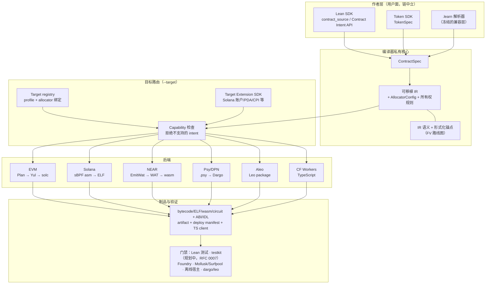

# ProofForge

Lean 优先的多链智能合约平台。

ProofForge 的目标是：一份经过验证的 Lean 合约代码库，可以在多个区块链目标家族
中编译、测试和部署。合约面向链中立的 Contract Intent API 编写；编译器将其降级
为可移植 IR，按目标做 capability 路由，并产出链原生制品。目标不支持的能力会在
编译期被拒绝，而不是静默改变语义。

入口文档：

- [docs/INDEX.md](../INDEX.md) — 完整文档地图。
- [RFC 0001](../rfcs/0001-multichain-platform.md) — 多链架构与路线图；
  [RFC 0002](../rfcs/0002-target-implementation-design.md) — 目标实现设计。
- [Design decisions](../decisions.md) — 已定决策（D-001…D-045）。
- [形式化验证路线图](../formal-verification.md) — 现有证明锚点与分阶段定理目标。

中文文档：

- [中文文档索引](README.md)
- [架构评审（2026-07）：统一 SDK 输入与分支收敛](architecture-review-2026-07.md)
- [多链愿景可行性分析](feasibility-analysis.md)

## 后端状态

所有后端都在 `main` 上（"链"是目录和 target id，不是分支）。生命周期阶段见
[docs/targets/README.md](../targets/README.md)。
当前产品实现受主三链完成规约 (D-045) 约束：先按顺序把
`solana-sbpf-asm`、`evm`、`wasm-near` 做到生产级完善，然后任何额外链才能推进到
docs-only research 或冻结 spike 维护之外。

| Target id | 管线 | 阶段 | 本地验证 |
|---|---|---|---|
| `evm` | Lean / portable IR → Yul → `solc` → bytecode | 基线（成熟） | golden Yul、诊断、Foundry 运行时冒烟、Anvil 部署 |
| `solana-sbpf-asm` | portable IR → sBPF assembly → `sbpf` → ELF | Experimental | Mollusk 测试、Surfpool/Web3.js live 冒烟、Pinocchio 等价性门禁 |
| `wasm-near` | portable IR → `EmitWat`（Wasm AST → WAT）→ `wat2wasm` | Experimental | 45 例诊断、IR 覆盖清单、形式化 trace obligation、离线宿主冒烟 |
| `psy-dpn` | portable IR → `.psy` → Dargo → DPN circuit JSON | Experimental（受限子集） | golden source、诊断、`dargo` execute 冒烟 |
| `aleo-leo` | portable IR → Leo package → `leo build`/`leo test` | Research spike | Counter/PureMath golden fixture 与冒烟 |
| `wasm-cloudflare-workers` | portable IR → TypeScript Worker | Research（链下宿主，D-033） | `tsc` 类型检查、`wrangler` dry-run |

多链 Token SDK（`TokenSpec`，[RFC 0006](../rfcs/0006-multichain-token-sdk.md)）
把同一份 token 意图在 EVM 上路由为 ERC-20 bytecode，在 Solana 上路由为
SPL Token / Token-2022 部署计划。

## 快速开始

从 [casey/just](https://github.com/casey/just) 安装 `just`；根目录 `justfile`
是面向开发者的命令目录和 CI 入口。

```sh
just --list        # 所有 recipe
just build         # lake build
just check         # 快速静态门禁（Lean + EVM + Psy）
just evm-all       # 完整 EVM 门禁：示例编译、Foundry 冒烟、Anvil 部署
just ci            # 本地跑完整 CI 序列
```

直接用 Lake 构建：

```sh
lake build
```

把 EVM Counter 示例编译为运行时 bytecode：

```sh
lake env proof-forge --evm-bytecode --root . --module contract \
  -o build/evm/Counter.bin Examples/Evm/Contracts/Counter.lean
```

从内置的 portable IR fixture 产出其他目标的制品：

```sh
lake env proof-forge --emit-counter-emitwat -o build/wasm-near   # NEAR Wasm
lake env proof-forge --solana-elf -o build/solana/counter.so     # Solana ELF
lake env proof-forge --emit-counter-ir-psy -o build/psy/Counter.psy
lake env proof-forge --emit-counter-ir-leo -o build/aleo         # Aleo Leo
lake env proof-forge --emit-counter-ir-ts -o build/ts/Counter.ts # CF Workers
```

各目标完整的可运行验证命令及工具前置条件（Foundry、`solc`、`sbpf`、
`wat2wasm`、`dargo`、`leo`、`wrangler` 等）见
[docs/validation-gates.md](../validation-gates.md)。云端/agent 环境说明见
[AGENTS.md](../../AGENTS.md)。

## 架构



- **Contract Intent API** — 默认 SDK 表面：state、entrypoint、event、
  caller/value 访问、checked 算术、断言和证明，不需要 import 目标链模块。
- **Target Extension SDK** — 合约确实需要链原生语义时显式引入（Solana
  账户/PDA/CPI、allocator 选择等）。扩展通过 capability id 和 target
  metadata 降级，绝不给可移植 IR 增加仅单链使用的 constructor（D-027）。
- **Target adapter** — 每个链家族的 ABI、打包、测试运行器和部署逻辑；
  `--target` 选择 adapter，不支持的 intent 在产出制品前被拒绝（D-028）。

作者层边界见 [docs/authoring-model.md](../authoring-model.md)（遗留 `.learn`
解析器是冻结的兼容层，不是第二门产品语言）；IR 规范见
[docs/portable-ir.md](../portable-ir.md)。

## 开发文档

- [Development standards](../development-standards.md)
- [Validation gates](../validation-gates.md)
- [Implementation backlog](../implementation-backlog.md) — 当前优先级是
  Workstream 24（合并收敛跟进）和 Workstream 25（形式化验证）。
- [Capability registry](../capability-registry.md)
- [Shared scenario: Counter](../shared-scenario.md) — 跨目标验收测试；
  当前阶段目标是在 `evm` + `solana-sbpf-asm` + `wasm-near` 上跑通。
- Target 说明：[docs/targets/](../targets/README.md)

## 模块命名

- **Lake module：** `ProofForge.Evm`（合约文件中 import）。
- **Lean namespace：** `Lean.Evm`（示例中 `open Lean.Evm`）。

这一拆分来自 Lean fork 迁移。统一重命名到 `ProofForge.*` 命名空间已列入
backlog（Workstream 24），因为 `Lean.Evm` 会遮蔽 Lean 编译器自身的 `Lean`
命名空间。

## 路线图

```text
Phase 0: EVM 基线                          （完成）
Phase 1: target registry + portable IR     （完成）
Phase 2+: 并行后端 spike                   （Solana、NEAR、Psy 已在 main；
                                            Aleo、CF Workers 为 research）
当前:     shared scenario 在 evm + solana-sbpf-asm + wasm-near 跑通，
          合并收敛跟进（Workstream 24），
          形式化验证路线图（Workstream 25）
之后:     Move 家族（Aptos 优先）、云平台（两个以上目标达到
          Experimental 且 shared-scenario 对齐后；D-010）
```

规范 target id 与完整决策日志：[docs/decisions.md](../decisions.md)。
`docs/targets/solana-sbf.md` 是 Solana 目标说明的历史别名；规范路线是
`solana-sbpf-asm`（D-026）。
